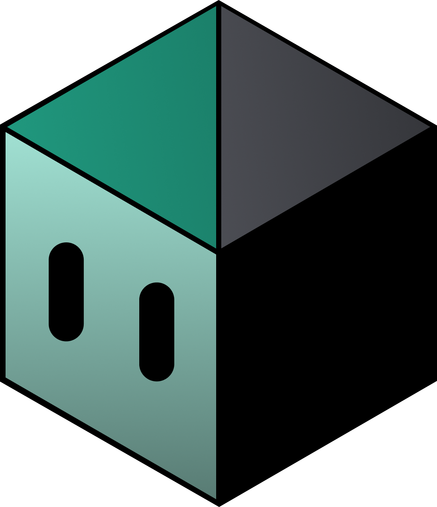

<p style="text-align:center;">
  
</p>

## IGESTINHA
 
Este projeto é um chatbot inteligente desenvolvido com **Flask e Langchain**, integrado a um banco de dados **MongoDB** e projetado para responder perguntas ou executar ações com base nos dados armazenados nas contagens do app IGesta.

---

## 🚀 Funcionalidades

- 🔍 Consulta de dados em tempo real no **MongoDB**
- 💬 Interação inteligente via API RESTful e Inteligência Artifical
- 🧠 Integração com modelos de linguagem (Gemini, LangChain)

---

## EXEMPLO DE REQUISIÇÃO
```
POST https://chatbot-mobile-igesta.vercel.app/chat
Content-Type: application/json

{
    "usuario": "<mensagem>",
    "unidade": "<nome-unidade-da-empresa>"
}
```

### Dependências necessárias
- `flask`
- `flask-cors`
- `langchain`
- `langchain-core`
- `langchain-google-genai`
- `python-dotenv`
- `gunicorn`
- `langchain-community`
- `pymongo`
- `pydantic`
- `typing-extensions`
- `pytz`


Desenvolvido por: [**Rafael Cruz**](https://github.com/RafaelBarretoCruz)


